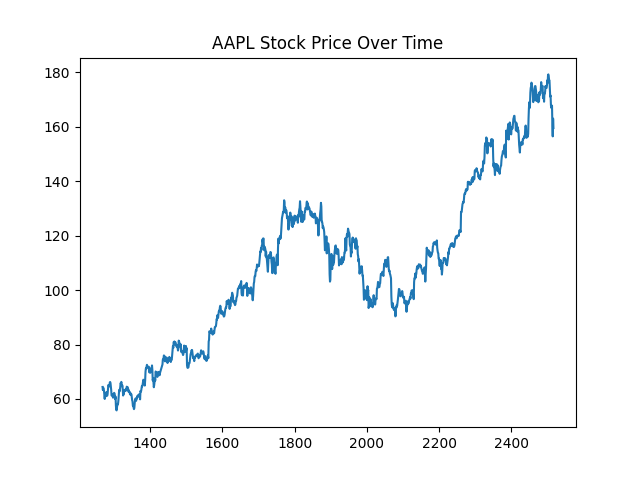

# Predicting AAPL Stock Return Direction Using Machine Learning

## Project Overview
This project uses historical S&P 500 stock data from Kaggle to predict whether Apple (AAPL) stock will move up or down the next trading day. The project applies the full predictive analytics workflow, including data cleaning, feature engineering, machine learning modeling, and model evaluation.

## Business Questions
1. Can machine learning predict whether AAPL stock will increase or decrease the next trading day?
2. Which financial indicators are most important in predicting stock direction?
3. Which model performs better: Logistic Regression or Random Forest?

## Dataset
The dataset comes from Kaggle and includes historical S&P 500 stock prices, including open, high, low, close, volume, date, and company ticker.

## Methods
The analysis includes:
- Data cleaning
- Feature engineering
- Daily return calculation
- Moving averages
- Volatility
- Volume change
- Logistic Regression
- Random Forest Classification

## Results
The Logistic Regression model achieved about 48.4% accuracy, while the Random Forest model achieved about 50.8% accuracy. These results show that short-term stock movement prediction is difficult and close to random guessing, which aligns with the Efficient Market Hypothesis.

## Key Insights
Volume change, recent returns, volatility, and moving averages were the main predictors used in the model. The limited accuracy highlights the complexity of predicting short-term financial markets.

## Tools Used
- Python
- Google Colab
- Pandas
- Scikit-learn
- Matplotlib
- Kaggle

## Visualizations

### AAPL Stock Price Over Time

## How to Run
Open the notebook in Google Colab and run each cell from top to bottom.
You can view and run the notebook here:
[Open in Colab](https://colab.research.google.com/drive/1xiMlw8snTM_sa2abtGPCOz1Tnva1t99C?usp=sharing)
